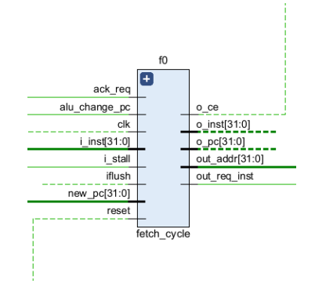
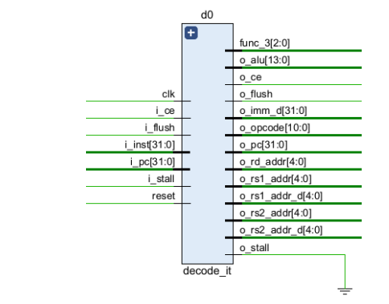
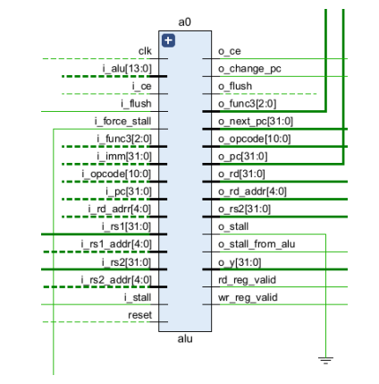
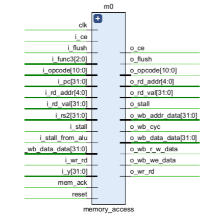
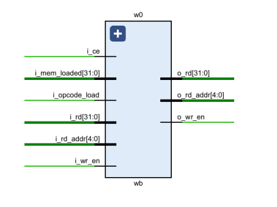
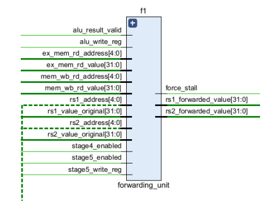
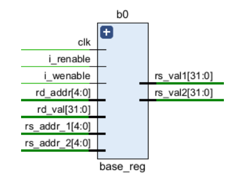
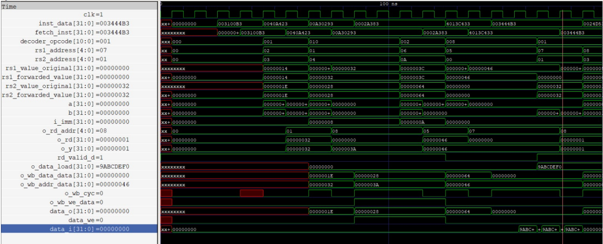

# RV-32I Simulation and details

## # Instructions Included

- I have decided to carry out the following instructions:
- • ADD - R-type
- • ADD - R-type
- • SUB - R-type
- • SLL - R-type
- • SRL - R-type
- • SLT - R-type
- • AND - R-type
- • XOR - R-type
- • OR - R-type
- • SLTU - R-type
- • BEQ - SB-type
- • BNEQ - SB-type
- • BGE - SB-type
- • SRA - R-type
- • BGEU - SB-type  

## Instruction Fetch  
 

## Instruction Decode

## ALU

## Memory Access

## Write Back

## Forwarding Unit

## Register File

## RV32I-Top module
- The processor’s pipeline is coordinated through a system of carefully synchronized
control signals and data paths. The i clk signal serves as the fundamental timing
reference, ensuring all pipeline stages (fetch, decode, execute, memory access, and
write-back) operate in lockstep. A synchronous reset (i rst) initializes all internal
registers to a known state, while the instruction fetch interface (i inst, o addr,
o stb inst) manages the flow of instructions from memory into the pipeline. The
fetch stage’s operation is further regulated by synchronization signals: i ack
confirms successful instruction retrieval, while i stall and i flush handle
pipeline control hazards and instruction redirection.

## Simulation Results  

- I successfully tested the following instructions on this processor
- ADD x1, x2, x3
- SW x4, 8(x1)
- ADDI x5, x6, 10
- LW x7, 0(x5)
- SUB x8, x7, x1
- AND x9, x8, x3
- OR x10, x9, x2
- BEQ x1, x2, 16
- BNE x5, x4, -4
- JAL x11, 20

### Waveforms-->

